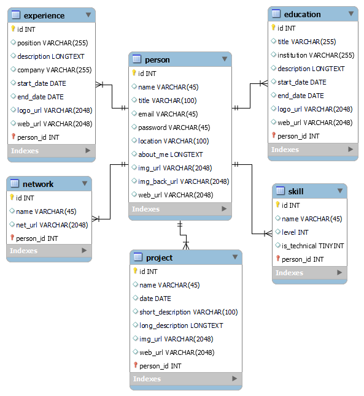

## Backend para el portfolio

Backend desarrollado con Java Springboot.

Este proyecto es una <b>API REST</b>.

## Documentación <b>API-REST</b>

* <a href="https://portfolio-backend-ss.onrender.com/swagger-ui" target="_blank">Link a la documentación Generada con Swagger UI y Open API.</a>

## Diagrama DER

* En la carpeta "sql" están el diseño de la base de datos en formatos DER y el script para crear la base de datos

## Tecnologías usadas:

* SpringBoot 3.0.5
* Java 17
* Swagger UI

## Plataformas y servicios usados:

* <a href="https://portfolio-backend-ss.onrender.com" target="_blank">Render (Heakth check page)</a> para alojar la aplicación de backend.
* <a href="https://stats.uptimerobot.com/XBxDGu4LpO" target="_blank">Uptime Robot (Status page)</a> para mantener el servicio activo  e impedir que render apague la aplicación.

## Estado Actual:

* Implementada funcionalidades de CRUD y login con JWT Bearer y cookie (no al mismo tiempo)
* Relaciones many-to-one para correcta representación del DER y borrado en cascada
* Funcionalidad completa y optima en todas las entidades
* Se permite crear nuevos usuarios y sus propias entidades con sus relaciones y borrado en cascada o sea crear un usuario con sus propios proyectos, experiencias, etc, que son solo editables por el y se pueden visualizar en el sitio al logearse y deslogearse.
* Principios SOLID
* Flujo de trabajo GIT Flow.
* Versionado Semantic Versioning 2.0.0

## Actualmente implementando:
* Refactorización DTO para las demás entidades además de la principal.

## Decisiones de diseño

* Deshabilitando Spring open session in view (OSIV) y @Transactional para lograr mejor performance relacionada con la base de datos (https://www.baeldung.com/spring-open-session-in-view)
* Usando relaciones many-to-one por ser mas versátiles que one-to-many en relación con paginación y filtrado y ordenamiento ()
* Inicialmente había implementado JWT usando cookies para la comunicación Backend/Frontend, pero ahora implementé tipo Bearer para solucionar el problema de las plataformas de hosteo estando en diferentes servidores y ser blockeadas por las políticas CORS de los navegadores modernos.
* Las clases de mapeo de entidades inicialmente las diseñé con idea de que sean lo más flexibles posibles, siendo que todavía no sabía cuáles queries iba a terminar necesitando finalmente. Esto puede causar un uso innecesario de recursos y ancho de banda, por lo cual seguramente refactorice estas clases para que sean más eficientes, más que nada cambiando el uso de objetos "Person" dentro de las entidades hijas por un ID a la entidad padre, permitiendo más eficiencia y mejores prácticas.

## Desarrollador
* Sebastián Sala - *Diseño e implementación del Sistema*
