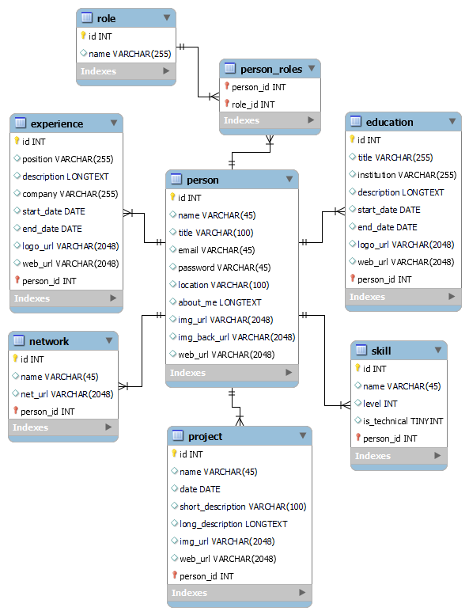

## Backend para el portfolio

Backend desarrollado con Java Springboot.

Este proyecto es una <b>API REST</b>.

## Documentación <b>API-REST</b>

* <a href="https://portfolio-backend-ss.onrender.com/swagger-ui" target="_blank">Link a la documentación Generada Por Swagger UI y Open API.</a>

## Diagrama DER

## Tecnologías usadas:

* SpringBoot 3.0.5
* Java 17
* Swagger UI

## Estado Actual:

* Implementada funcionalidades de CRUD y login básico
* Relaciones many-to-one para correcta representación del DER y borrado en cascada
* Funcionalidad completa y optima en entidades Persona y Proyectos
* Se permite crear nuevos usuarios y sus propias entidades con sus relaciones y borrado en cascada o sea crear un usuario con sus propios proyectos, experiencias, etc, que son solo editables por el y se pueden visualizar en el sitio al logearse y deslogearse.

## Actualmente implementando:
* Login avanzado con JWT
* Implementación y refactorización del resto de enpoints para las entidades.

## Desarrollador
* Sebastián Sala - *Diseño e implementación del Sistema*

## Contacto 
* sebastiansala.dev@gmail.com
* https://sebastiansala.web.app